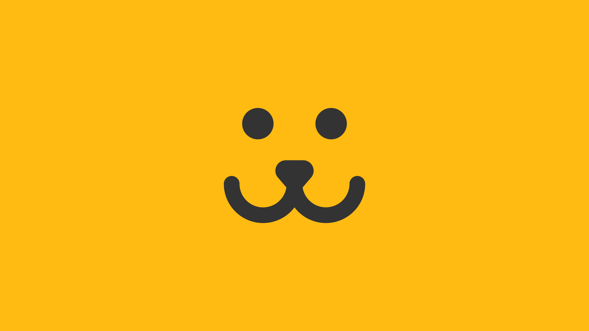

## 📌 Índice

- [Sobre](#-sobre)
- [Tecnologias utilizadas](#-tecnologias-utilizadas)
- [Como baixar o projeto](#-como-baixar-o-projeto)

---

## 🔖 Sobre

Mais um projeto de estudo concluído, dessa vez uma rede social para seu dog feito em ReactJS, **Dogs**. Foi desenvolvido como atividade final no curso de React Completo da Origamid e o resultado é esse.

<h3 align="center">
    <a href="https://dogs-project-delta.vercel.app/">Acessar a demonstração</a>
<h3>

---

## 🚀 Tecnologias utilizadas

O projeto foi desenvolvido utilizando as seguintes tecnologias:

- [Vite](https://vitejs.dev/)
- [CSS Modules](https://nextjs.org/docs/app/building-your-application/styling/css-modules)
- [ReactJS](https://react.dev/)
- [React Router](https://reactrouter.com/en/main)
- [Victory](https://commerce.nearform.com/open-source/victory/)

---

## 🗂 Como baixar o projeto

```bash
    # Clonar o repositório
    $ git clone https://github.com/bagrielz/dogs-project

    # Entrar no diretório
    $ cd dogs-project

    # Instalar as dependências
    $ npm install

    # Iniciar o projeto
    $ npm run dev
```

---

Desenvolvido 🤘 por Gabriel Stênio, direitos do projeto **Origamid**
